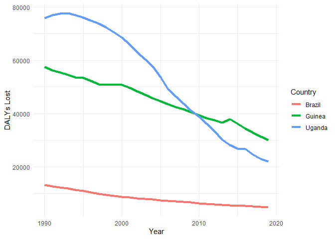
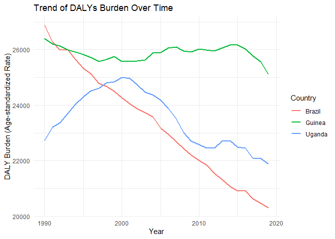
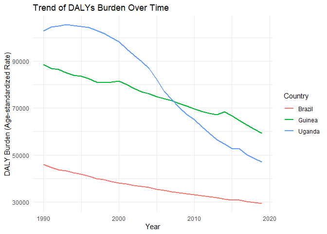

Global Disease Burden Analysis
================
Mamadou Saidou Alareny Baldé (Guinea), Carola Salas (Brazil), Margaret
Nagawa(Uganda)

# Introduction

This document compares the Disability-Adjusted Life Year (DALY) diseases
burden for three countries: Brazil, Guinea,and Uganda. We compare the
burden due to communicable, maternal, neonatal, and nutritional diseases
(CMNN), non-communicable diseases (NCDs), and overall disease burden for
these countries.

The source data is from the Institute for Health Metrics and Evaluation
(IHME) Global Burden of Disease (GBD) study.

# Communicable, Maternal, Neonatal, and Nutritional Disease Burden (CMNN)

## Table of Estimates for CMNN Burden Over Time

| Year |    Brazil |   Guinea |   Uganda |
|-----:|----------:|---------:|---------:|
| 1990 | 13225.128 | 57578.12 | 75944.97 |
| 1991 | 12673.758 | 56177.98 | 76978.02 |
| 1992 | 12185.614 | 55522.14 | 77511.61 |
| 1993 | 11785.299 | 54579.50 | 77695.11 |
| 1994 | 11354.494 | 53669.65 | 76948.73 |
| 1995 | 10902.863 | 53336.46 | 76070.29 |
| 1996 | 10412.660 | 52300.97 | 74909.36 |
| 1997 |  9862.100 | 51057.38 | 73726.62 |
| 1998 |  9455.976 | 50754.89 | 72243.52 |
| 1999 |  9092.276 | 50898.90 | 70524.46 |
| 2000 |  8735.082 | 50837.51 | 68550.38 |
| 2001 |  8419.143 | 49601.09 | 65942.75 |
| 2002 |  8141.936 | 48396.62 | 63032.73 |
| 2003 |  7902.076 | 47072.43 | 60345.84 |
| 2004 |  7649.297 | 45714.37 | 57778.01 |
| 2005 |  7389.195 | 44600.93 | 53612.07 |
| 2006 |  7144.881 | 43473.00 | 49145.64 |
| 2007 |  6929.458 | 42427.31 | 46258.95 |
| 2008 |  6724.427 | 41556.58 | 43621.19 |
| 2009 |  6531.678 | 40541.27 | 41071.17 |
| 2010 |  6320.505 | 39292.58 | 38831.56 |
| 2011 |  6118.744 | 38271.07 | 36196.78 |
| 2012 |  5908.903 | 37491.42 | 33312.56 |
| 2013 |  5735.977 | 36630.03 | 30292.27 |
| 2014 |  5524.620 | 37951.45 | 28099.68 |
| 2015 |  5370.292 | 36234.55 | 26900.48 |
| 2016 |  5254.790 | 34333.19 | 26645.55 |
| 2017 |  5122.277 | 32829.75 | 24668.12 |
| 2018 |  4979.530 | 31302.00 | 22896.94 |
| 2019 |  4838.168 | 30054.11 | 21904.64 |

## Plot Showing Trends in CMNN Burden Over Time

<!-- -->

## Summary of CMNN Burden Findings

Uganda and Guinea had big increase of the DALY diseases burden due to
CMNN in 1990, however these trends decreased significantly between 1990
and 2020. In the other hand,the CMNN burden was generally lower in
Brazil. Note that these results show that important efforts was made in
those three countries between 1990 and 2020.

# Non-Communicable Disease Burden (NCD)

## Table of Estimates for NCD Burden Over Time

| Year |   Brazil |   Guinea |   Uganda |
|-----:|---------:|---------:|---------:|
| 1990 | 26878.18 | 26409.09 | 22727.60 |
| 1991 | 26274.16 | 26204.44 | 23206.69 |
| 1992 | 25980.82 | 26126.49 | 23368.22 |
| 1993 | 25987.45 | 25987.81 | 23709.61 |
| 1994 | 25642.50 | 25924.56 | 24026.41 |
| 1995 | 25320.93 | 25824.00 | 24297.30 |
| 1996 | 25135.56 | 25722.26 | 24516.17 |
| 1997 | 24790.31 | 25580.54 | 24611.35 |
| 1998 | 24678.36 | 25655.05 | 24812.32 |
| 1999 | 24505.38 | 25750.12 | 24845.58 |
| 2000 | 24259.14 | 25575.41 | 24996.34 |
| 2001 | 24054.18 | 25572.05 | 24965.22 |
| 2002 | 23876.85 | 25598.80 | 24729.75 |
| 2003 | 23726.83 | 25627.95 | 24456.48 |
| 2004 | 23577.01 | 25872.75 | 24381.15 |
| 2005 | 23171.79 | 25905.90 | 24180.73 |
| 2006 | 22954.68 | 26064.06 | 23896.03 |
| 2007 | 22684.44 | 26099.41 | 23518.92 |
| 2008 | 22432.92 | 25955.25 | 23007.55 |
| 2009 | 22202.47 | 25911.76 | 22711.37 |
| 2010 | 22005.03 | 26022.82 | 22576.37 |
| 2011 | 21845.06 | 25986.43 | 22459.96 |
| 2012 | 21549.33 | 25958.06 | 22453.22 |
| 2013 | 21327.61 | 26052.68 | 22702.08 |
| 2014 | 21068.12 | 26170.02 | 22726.48 |
| 2015 | 20914.63 | 26174.00 | 22494.26 |
| 2016 | 20920.49 | 26030.49 | 22459.26 |
| 2017 | 20629.32 | 25780.08 | 22080.32 |
| 2018 | 20465.81 | 25560.25 | 22069.92 |
| 2019 | 20309.17 | 25112.67 | 21890.06 |

DALY Burden Over Time for Selected Countries

## Plot Showing Trends in NCD Burden Over Time

<!-- -->

## Summary of NCD Burden Findings

Regarding the findings from database DALYs (Disability-Adjusted Life
Years) about non communicable diseases. This has reduced steadily for
the largest country in South American country as Brazil since 1990.
Regarding the two African countries, we found that Uganda picked the
values between 1990 and early 2000s, to follow a trend to reduction
since then until 2010, with a minor increase to resume the trend of
reduction. This observation is not the same for Guinea that has kept a
regular trend to high values across the time.

# Overall Disease Burden

## Table of Estimates for Overall Disease Burden Over Time

| Year |   Brazil |   Guinea |    Uganda |
|-----:|---------:|---------:|----------:|
| 1990 | 45962.15 | 88486.15 | 102836.41 |
| 1991 | 44620.25 | 86824.47 | 104495.04 |
| 1992 | 43648.84 | 86401.49 | 104906.63 |
| 1993 | 43268.12 | 84956.20 | 105452.21 |
| 1994 | 42456.26 | 83974.02 | 105162.61 |
| 1995 | 41727.34 | 83615.38 | 104720.27 |
| 1996 | 41005.87 | 82400.44 | 104297.13 |
| 1997 | 40014.81 | 80945.31 | 103047.87 |
| 1998 | 39427.12 | 80799.80 | 101752.00 |
| 1999 | 38776.75 | 81095.36 | 100037.58 |
| 2000 | 38131.24 | 81532.78 |  98171.09 |
| 2001 | 37583.18 | 79962.21 |  95215.63 |
| 2002 | 37126.16 | 78276.52 |  92519.77 |
| 2003 | 36664.31 | 76967.40 |  89701.22 |
| 2004 | 36173.63 | 75998.33 |  86815.43 |
| 2005 | 35395.81 | 74881.21 |  82093.89 |
| 2006 | 34895.73 | 73981.17 |  77085.54 |
| 2007 | 34368.23 | 73072.75 |  73673.33 |
| 2008 | 33913.99 | 71844.31 |  70341.74 |
| 2009 | 33487.78 | 70918.41 |  67412.10 |
| 2010 | 33067.23 | 69635.84 |  65086.43 |
| 2011 | 32726.92 | 68574.22 |  62187.53 |
| 2012 | 32177.95 | 67730.57 |  59246.96 |
| 2013 | 31776.73 | 67087.79 |  56555.76 |
| 2014 | 31271.43 | 68473.84 |  54585.84 |
| 2015 | 30873.99 | 66737.16 |  52892.96 |
| 2016 | 30776.76 | 64627.63 |  52600.05 |
| 2017 | 30229.88 | 62807.74 |  50117.66 |
| 2018 | 29798.11 | 60991.29 |  48361.31 |
| 2019 | 29427.39 | 59164.53 |  47042.35 |

DALY Burden Over Time for Selected Countries

## Plot Showing Trends in Overall Disease Burden Over Time

<!-- -->

## Summary of Overall Disease Burden Findings

Overall, the findings reveal a downward trend in disability adjusted
life years for overall burden of disease with Brazil having the least
DALYs. Interestingly, while Guinea had less DALYs than Uganda before
2010, Uganda has surpased Guinea with lower DALYs. This could be
attributed to political stability, economic growth and good
implementation of health policies.
